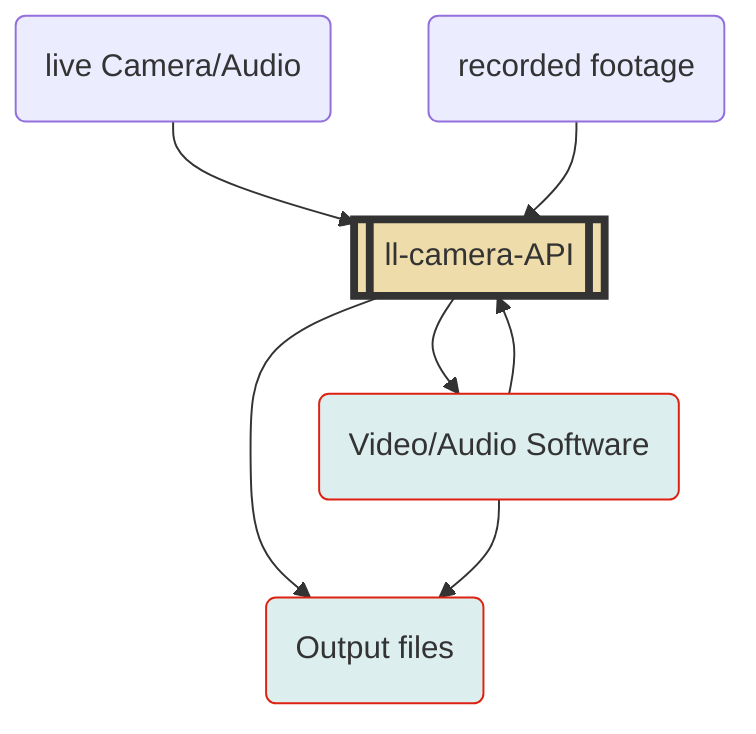
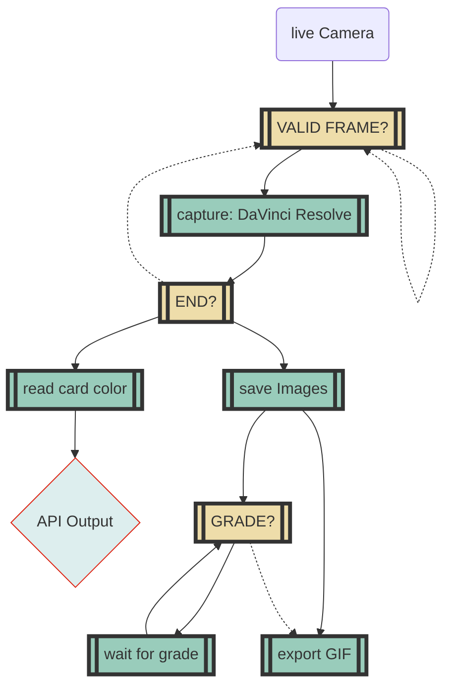

---
title: 'Camera API For Learning Lab'
disqus: hackmd
author: Joey Huang
---

ll-camera-magic
===

**LLUF**: @joeykhuang 

## Table of Contents

[TOC]

## Goals
:::info
**Explore how code/automation can integrate with cool camera tech**:
The Learning Lab is full of all types and sizes of camera and camera equipment that documents every wonderful thing that people do here. From the footage captured by the cameras, we're able to create many cool things: recolorization, montages, buttons!!, etc..
However, many post-capture processes still require a high degree of repetitive manual labor (i.e. documenting cards & rendering them into a montage). The goal of this project is to develop an easy-to-use API/workflows that simplifies the process of working with raw camera captures, allowing a higher degree of camera integration with the rest of the ll workflow. 
:::

API Structure
---

The ultimage goal of the API would be a two-pronged approach: 

- one part of the API deals with captures (live and recorded): importing / denoising / downresolution / color analysis / OCR
- another part of the API deals with video/audio software and output: DaVinci Resolve / FCP / GIFbot / file format conversion

Workflow Integration (Ideation)
---
Here are some ideas for workflow integration:

- Simplifying card documentation (original motivation) by automating captures after card is stable
    - Input: live camera feed
    - Output: GIF & raw images
- Extracting card color information from image and associate with an instrument sound in Garageband (i.e. putting a yellow card on the table will result in a cymbal sound being played)
    - Input: live camera feed
    - Output: color information + sound
- Automating button-making for faces: stills from camera would automatically be processed in lightroom and sent to the printer
    - Input: stream of camera stills
    - Output: printed processed headshot images
- Posting highlight reels via ll-studio-bot to appropriate slack channels
    - Input: live camera feed
    - Output: GIF/videos in ll-show-your-images channel

MVP Design
---

For the first stage of this project, I want to create a workflow using the ll-camera-API to simplify card documentation: live camera footage from the overhead camera in the break room would be processed, and once the workflow detects that there is no hand in the frame and the card is stable, it takes a picture and plays a beep to indicate to switch to the next card. After all cards have been finished documented, the workflow would save all the images, wait for the user to grade in DaVinci Resolve, and then save all the graded images and turn it into a GIF. 

## Appendix
DaVinci Resolve API: https://deric.github.io/DaVinciResolve-API-Docs/

notes:
make post requests in a way you don't have to manually code yourself. cv server running on one machine viewing whats happening on the cam and have it fire http rewuests that go to our other apps,etc.

server sees something and send JSON to a server we determine. and e can figure out how we handle that later. as you develop things we can determine which events we actually want to send. but for now we just want to send the events to one of our slack apps. we don't care too much about connecting it to resolve immed it sjust getting it to send messages to slack. we'd prob want it to just send a message to slack. we can look at the /switch command to see anexample. 

use ocr to create a switcher. show the swtich app. your thing will emit those events so when we put a card with the number 2 on it it switches to cam 2

the MVP doesn't even include resolve. it's just the read card thing.

later on, in the blackmagic code, there are some beg apps that interact more directly with the hardware.

build the camera eyeball api and this brain that watches it. 